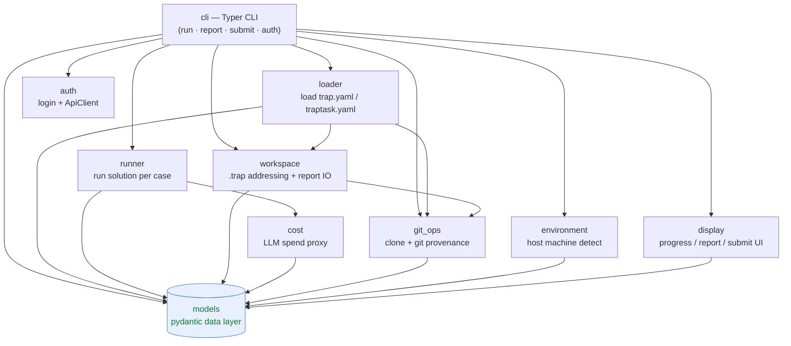
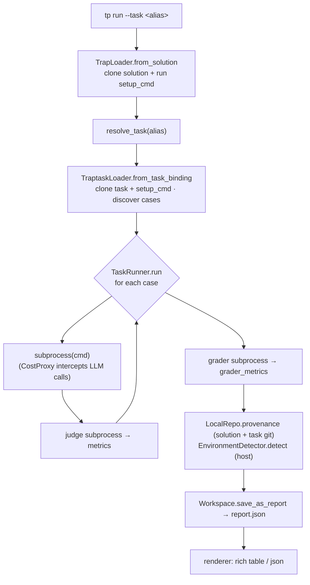
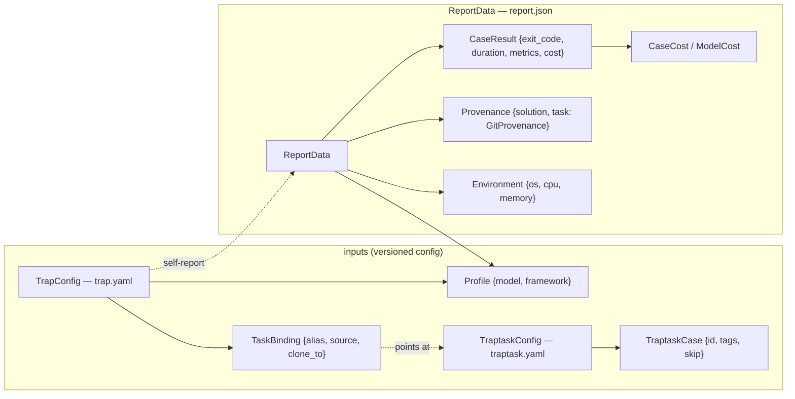

# Code map — `trap` CLI

A developer's-eye view of how the package fits together. Diagrams are
[Mermaid](https://mermaid.live) — they render on GitHub, in VS Code (Markdown
preview), and at mermaid.live. Generated from the actual `import` graph under
`src/trap/`.

## 1. Package dependency graph

`models/` is the shared, serialisable data layer at the bottom — everything
depends on it, it depends on nothing internal. `cli/` is the top-level
orchestrator. Each behaviour package talks to the rest only through `models`
(the Rust-rewrite boundary rule).

### Package responsibilities

| Package | Owns | Key types |
|---|---|---|
| `cli` | Typer entry point + commands; orchestrates a run | `run` / `report` / `submit` |
| `models` | All pydantic data (config + wire format); the shared layer | `TrapConfig`, `TaskBinding`, `TraptaskConfig`, `ReportData`, `Profile`, `Provenance`, `Environment`, `CaseResult`, `CaseCost` |
| `loader` | Parse trap.yaml / traptask.yaml; clone + setup; discover cases | `TrapLoader`, `TraptaskLoader` |
| `runner` | Execute the solution subprocess per case; run judge/grader | `TaskRunner` |
| `cost` | Intercept LLM API calls via a local reverse proxy; tally spend | `CostProxy` |
| `git_ops` | Clone/fetch repos; compute `{repo, commit}` provenance | `LocalRepo`, `RemoteRepo`, `ParsedGitUrl` |
| `workspace` | `.trap` addressing (solution keys, run layout, derived `latest`) + `report.json` IO | `SolutionIdentity`, `Workspace` |
| `environment` | Best-effort host machine detection | `EnvironmentDetector` |
| `display` | Live progress bar; report + submit-result rendering | `CaseProgress`, `RichRenderer`, `JsonRenderer` |
| `auth` | Login (OAuth), per-server token store, env/stored resolution, upload client | `ApiClient`, `AuthStore`, `resolve_auth` |

## 2. `tp run` runtime flow

## 3. Core data models (what lands in the report)

---

*Regenerate the package graph: AST-walk `src/trap/**/*.py` for `from trap.<pkg>`
imports and aggregate per top-level package (see the one-off script in the PR that
added this file).*
